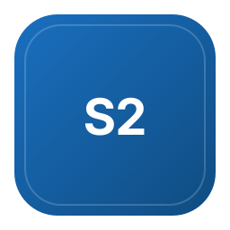

# Awesome SysML V2 

> Systems Modeling Language version 2 specifications, tools, and models.

For the MagicGrid MBSE methodology, see the sister list [awesome-magicgrid-mbse](https://github.com/jgsystemsconsulting/awesome-magicgrid-mbse).

> Systems Modeling Language version 2 specifications, tools, and models.

## Contents

- [Specifications and Standards](#specifications-and-standards)
- [Official Implementations](#official-implementations)
- [Editors and Language Tooling](#editors-and-language-tooling)
- [Modeling and Visualization](#modeling-and-visualization)
- [Parsers, SDKs, and API Clients](#parsers-sdks-and-api-clients)
- [Validation and Analysis](#validation-and-analysis)
- [Models and Case Studies](#models-and-case-studies)
- [Learning Resources](#learning-resources)
- [Deployment and Containers](#deployment-and-containers)
- [Commercial Tools](#commercial-tools)
- [Migrating from SysML v1](#migrating-from-sysml-v1)

## Specifications and Standards

- [KerML 1.0 (OMG)](https://www.omg.org/spec/KerML) - Formal specification of the Kernel Modeling Language that underpins SysML v2.
- [SysML 2.0 (OMG)](https://www.omg.org/spec/SysML/2.0) - Formal OMG specification of the SysML 2.0 language and its transformation, including machine-readable libraries.
- [SysML v2 tools page (OMG)](https://www.omg.org/sysml/sysmlv2/sysml-tool/) - OMG directory of tools that have announced SysML v2 support.
- [sysml-v2-docs](https://github.com/voidaliot/sysml-v2-docs) - Community-oriented mirror and notes on the SysML 2.0 specification documents.
- [SysML.org](https://sysml.org/) - SysML Partners site with a SysML v2 hub covering FAQs, tools, and training.
- [Systems Modeling API 1.0 (OMG)](https://www.omg.org/spec/SystemsModelingAPI) - Formal specification of the Systems Modeling API and Services with REST and OpenAPI platform-specific models.

## Official Implementations

- [SysML-v2-API-Cookbook](https://github.com/Systems-Modeling/SysML-v2-API-Cookbook) - Recipes for working with the Systems Modeling API.
- [SysML-v2-API-Java-Client](https://github.com/Systems-Modeling/SysML-v2-API-Java-Client) - Java client library for the Systems Modeling API.
- [SysML-v2-API-Services](https://github.com/Systems-Modeling/SysML-v2-API-Services) - Reference implementation of the Systems Modeling API services built on Spring.
- [SysML-v2-Pilot-Implementation](https://github.com/Systems-Modeling/SysML-v2-Pilot-Implementation) - Reference implementation of the textual notation and visualization based on Xtext and Eclipse.
- [SysML-v2-Release](https://github.com/Systems-Modeling/SysML-v2-Release) - Official incremental release of the specifications, standard libraries, sample models, and installers.

## Editors and Language Tooling

- [daltskin/sysml-v2-grammar](https://github.com/daltskin/sysml-v2-grammar) - ANTLR4 grammar for SysML v2 generated from the OMG BNF.
- [daltskin/sysml-v2-lsp](https://github.com/daltskin/sysml-v2-lsp) - ANTLR4-based language server and MCP server for SysML v2.
- [daltskin/VSCode_SysML_Extension](https://github.com/daltskin/VSCode_SysML_Extension) - VS Code extension for editing SysML v2.
- [DeciSym/sysml-mode](https://github.com/DeciSym/sysml-mode) - Emacs major mode for editing SysML v2.
- [mycr0ft/pygments-sysml](https://github.com/mycr0ft/pygments-sysml) - Pygments lexer for syntax highlighting SysML.
- [mycr0ft/sysml-vim](https://github.com/mycr0ft/sysml-vim) - Vim syntax support for SysML.
- [nomograph-ai/tree-sitter-sysml](https://github.com/nomograph-ai/tree-sitter-sysml) - Tree-sitter grammar for SysML v2.
- [sensmetry/sysml-2ls](https://github.com/sensmetry/sysml-2ls) - Open language support library for SysML v2 used by the Syside editor.
- [Syside Editor (VS Code)](https://marketplace.visualstudio.com/items?itemName=sensmetry.syside-editor) - Free VS Code and Open VSX editor extension for SysML v2 from Sensmetry.

## Modeling and Visualization

- [DeciSym/sysmlv2-gui](https://github.com/DeciSym/sysmlv2-gui) - Desktop GUI for the SysML v2 graphical notation.
- [demaconsulting/SysML2Workbench](https://github.com/demaconsulting/SysML2Workbench) - Desktop viewer and IDE for SysML v2 built on SysML2Tools.
- [eclipse-syson/syson](https://github.com/eclipse-syson/syson) - Open source web-based graphical modeling tool for SysML v2.
- [hightechlog/mbse-workbench](https://github.com/hightechlog/mbse-workbench) - MBSE workbench built on Eclipse SysON.
- [Open-MBEE/sysmlv2-web-modeler](https://github.com/Open-MBEE/sysmlv2-web-modeler) - Web-based modeler for SysML v2.
- [tukcps/SysMD](https://github.com/tukcps/SysMD) - Notebook-style tool for SysML v2 and KerML with an integrated solver.

## Parsers, SDKs, and API Clients

- [ansys/pysam-sysml2](https://github.com/ansys/pysam-sysml2) - Python API client and object model for SysML v2 aligned with Ansys SAM.
- [demaconsulting/SysML2Tools](https://github.com/demaconsulting/SysML2Tools) - Toolchain for .NET that parses, lints, and renders diagrams for SysML v2.
- [mycr0ft/sysmlpy](https://github.com/mycr0ft/sysmlpy) - Python parser for SysML v2 built on ANTLR.
- [Open-MBEE/sysmlv2-python-client](https://github.com/Open-MBEE/sysmlv2-python-client) - Community Python client for the SysML v2 API.
- [Open-MBEE/sysmod-sysmlv2-api](https://github.com/Open-MBEE/sysmod-sysmlv2-api) - SYSMOD extension for the SysML v2 API with MCP support.
- [sireum/hamr-sysml-parser](https://github.com/sireum/hamr-sysml-parser) - SysML v2 parser derived from the pilot ANTLR grammar for the HAMR toolchain.
- [STARIONGROUP/SysML2.NET](https://github.com/STARIONGROUP/SysML2.NET) - Implementation of OMG SysML 2 for .NET with an associated web viewer.
- [Westfall-io/sysml2py](https://github.com/Westfall-io/sysml2py) - Python parser for the SysML 2.0 textual notation.
- [zbigniewsobiecki/sysml2](https://github.com/zbigniewsobiecki/sysml2) - Command-line tool that parses, validates, queries, and modifies SysML v2 models.

## Validation and Analysis

- [ajhcs/cameo-mcp-bridge](https://github.com/ajhcs/cameo-mcp-bridge) - MCP bridge for creating and querying models in CATIA Magic and Cameo.
- [DeciSym/sysmlv2-validator](https://github.com/DeciSym/sysmlv2-validator) - Syntax checker for SysML v2 textual models.
- [Refinery Validation Pipeline](https://zenodo.org/records/19297800) - Archived validation pipeline for checking SysML v2 model patterns.
- [simoneCavalleri/fsmc](https://github.com/simoneCavalleri/fsmc) - State-machine compiler with formal verification that accepts SysML v2 among its input formats.

## Models and Case Studies

- [airbus/apollo-11-sysml-v2](https://github.com/airbus/apollo-11-sysml-v2) - Model of the Apollo 11 mission written in SysML v2.
- [BruceDouglass/SysML-v2-MasterClass](https://github.com/BruceDouglass/SysML-v2-MasterClass) - Example models accompanying the SysML v2 Masterclass book.
- [doug-rosenberg/structured-use-cases](https://github.com/doug-rosenberg/structured-use-cases) - Structured use-case library for SysML v2.
- [GfSE/SysML-v2-Models](https://github.com/GfSE/SysML-v2-Models) - Curated collection of SysML v2 models from the German Gesellschaft für Systems Engineering.
- [MBSE4U/dont-panic-batmobile](https://github.com/MBSE4U/dont-panic-batmobile) - Batmobile example model from the Don't Panic beginners' guide to SysML v2.
- [MBSE4U/PLEML](https://github.com/MBSE4U/PLEML) - MBPLE (model-based product line engineering) example models in SysML v2.
- [MBSE4U/sysmod-sysmlv2](https://github.com/MBSE4U/sysmod-sysmlv2) - SYSMOD language extension for SysML v2 with example models.
- [MBSE4U/the-sysmlv2-book-examples](https://github.com/MBSE4U/the-sysmlv2-book-examples) - Example models from The SysML v2 Book.
- [Open-MBEE/structured-use-cases](https://github.com/Open-MBEE/structured-use-cases) - Structured use-case library maintained by Open-MBEE.
- [sensmetry/advent-of-sysml-v2](https://github.com/sensmetry/advent-of-sysml-v2) - Advent-of-code style challenge models for learning SysML v2.

## Learning Resources

- [Advent of SysML v2](https://sensmetry.com/advent-of-sysml-v2/) - Annual series of SysML v2 learning challenges with model solutions.
- [MBSE Podcast](https://mbse-podcast.rocks/) - Podcast on model-based systems engineering with episodes covering SysML v2.
- [MBSE4U SysML v2 hub](https://mbse4u.com/sysml-v2/) - Collection of SysML v2 articles, FAQs, and learning material from MBSE4U.
- [OMG Systems Modeling Community](https://www.omg.org/communities/systems-modeling-community.htm) - OMG community page for systems modeling practitioners.
- [OOSE Learning Club SysML v2](https://clubs.oose.com/courses/sysmlv2/) - Microlearning course on SysML v2.
- [SodiusWillert SysML v2 cheat sheet](https://www.sodiuswillert.com/hubfs/Downloadables/SodiusWillertSysMLv2CheatSheet.pdf) - Downloadable PDF cheat sheet for SysML v2 syntax.
- [SysML v2 cheat sheet (Sensmetry)](https://sensmetry.com/sysml-cheatsheet/) - Web-based syntax cheat sheet for SysML v2.
- [The SysML v2 Book](https://mbse4u.com/books/the-sysml-v2-book-practical-insights-and-comprehensive-reference/) - Practical reference book on SysML v2 by Weilkiens and Molnar.
- [Visual Paradigm SysML v2 tutorials](https://sysml.visual-paradigm.com/) - Tutorials and kickstart guides for modeling in SysML v2.

## Deployment and Containers

- [jaydeanmartin/sysmlv2](https://github.com/jaydeanmartin/sysmlv2) - Docker Compose deployment of the SysML v2 pilot implementation.
- [mycr0ft/sysmlv2-jupyter-container](https://github.com/mycr0ft/sysmlv2-jupyter-container) - Podman container running Jupyter with SysML v2 support.
- [mycr0ft/SysON_podman_compose](https://github.com/mycr0ft/SysON_podman_compose) - Podman Compose setup for running Eclipse SysON.

## Commercial Tools

- [Ansys System Architecture Modeler](https://www.ansys.com/products/connect/ansys-system-architecture-modeler) - Ansys platform for systems architecture modeling that works with SysML v2.
- [Dalus](https://dalus.io) - MBSE platform built on SysML v2.
- [Intercax Syndeia](https://intercax.com/products/syndeia) - Digital thread platform that connects SysML v2 models with engineering tools.
- [LemonTree](https://www.lieberlieber.com/lemontree/en/) - Model comparison, diff, and merge tool for SysML v2 team workflows.
- [Siemens Systems Modeler](https://blogs.sw.siemens.com/teamcenter/tools-system-modeler-sysml-v2/) - Web-based collaborative graphical modeling tool for SysML v2 integrated with Teamcenter.
- [SysGit](https://www.sysgit.io/) - Git-centric collaboration platform for textual and graphical SysML v2.
- [Syside (Sensmetry)](https://sensmetry.com/syside/) - SysML v2 tool suite with a free editor and paid diagram, table, and automation features.
- [Tom Sawyer SysML v2 Viewer](https://www.tomsawyer.com/sysml-v2-viewer) - Interactive viewer with automatic layout for SysML v2 models via the Systems Modeling API.
- [Visual Paradigm SysML v2 Studio](https://www.visual-paradigm.com/features/sysml-v2/) - Modeling studio for SysML v2 with public tutorials.

## Migrating from SysML v1

- [Caltech CTME transition course](https://ctme.caltech.edu/transitioning-models-to-sysml-v2-with-mbse.html) - Training course on transitioning models from SysML v1 to SysML v2.
- [Cameo SysML v2 Community Edition docs](https://docs.nomagic.com/SYSML2P/2026x/catia-magic-cameo-sysml-v2-community-edition-286557495.html) - Vendor documentation for the SysML v2 Community Edition of CATIA Magic Cameo.
- [Flashlight starter model](https://www.omgwiki.org/MBSE/doku.php?id=mbse:sysml_v2_transition:sysml_v2_starter_model) - Transition teaching model with tutorial assets from the INCOSE wiki.
- [SysML Transformation specification (OMG)](https://www.omg.org/spec/SysML/2.0/Transformation/PDF) - Normative specification for transforming SysML v1 models into SysML v2.
- [SysML v2 Transition wiki](https://www.omgwiki.org/MBSE/doku.php?id=mbse:sysml_v2_transition) - INCOSE-maintained FAQ, conversion guidance, and tool matrix for moving from SysML v1 to v2.

## Contributing

See [contributing.md](contributing.md) for the inclusion criteria, entry format, local lint commands, and maintenance cadence.
